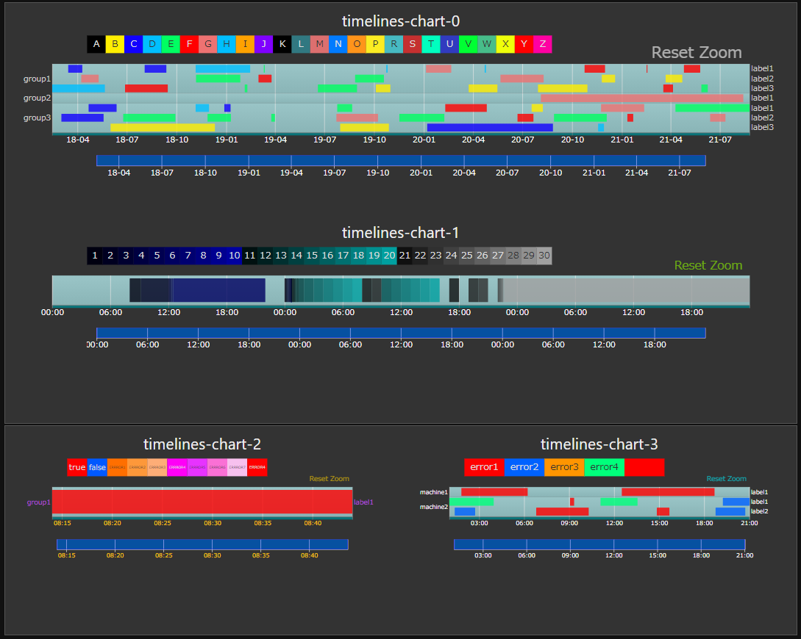
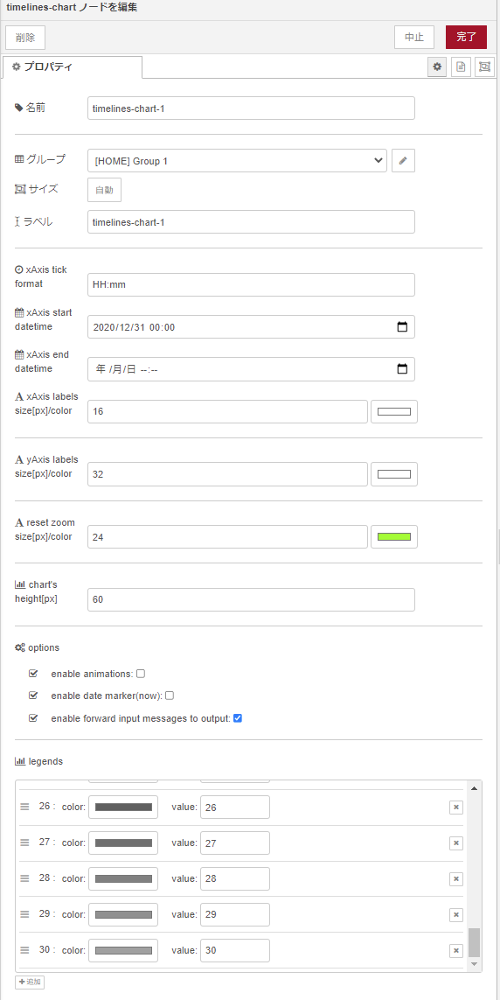

# node-red-contrib-ui-timelines-chart

A Node-RED widget node for showing the chart of status.




## Pre-requisites

The node-red-contrib-ui-timelines-chart requires `Node-RED Dashboard 2.10` to be installed.

## Folder structure

```cmd
root
│
├─data  -> node-RED work folder
│
├─dist  -> Build output folder
│
├─examples
│
├─figs
│
├─node_modules
│
├─src
│  │
│  ├─icons
│  │
│  ├─locales
│  │  ├─en-US
│  │  └─ja
│  │
│  ├─lib/js
│  │     ├─moment.min.js
│  │     ├─timelines-chart.min.js
│  │     └─utility.js
│  │
│  ├─ type.ts
│  ├─ define.ts
│  ├─ ui_timelines_chart.html
│  ├─ ui_timelines_chart.ts
│  └─ util.ts
│
├─.gitignore
├─.npmignore
├─build-exclude-filelist
├─build.bat  -> windows only
│
```

## Install

```cmd
npm install node-red-contrib-ui-timelines-chart
```

**Note**: This node uses APIs that require at least Node-RED 0.19 and Node-RED Dashboard 2.10.

## Usage

"ui-timelines-chart" node is a UI widget that can be used to display the chart of status in the Node-RED dashboard.

- Widget properties

  

  - name

    Set for the node name to be displayed in flow.

  - group

    Set for the group to be displayed on the dashboard.

  - size

    Set the size on the dashboard.

  - label

    Set for the name to be displayed on the dashboard.

  - xAxis tick format

    Set for the x-axis tick format.

    ```cmd
    - YYYY-MM-DD HH:mm:ss
    - YYYY-MM-DD
    - HH:mm:ss
    - HH:mm
    - HH
    ....
    ```

    **ISO 8601 format*

  - xAxis start date

    Set for the start time for the X axis.
    If not set, select the first data.

  - xAxis end date

    Set for the end time for the X axis.
    If not set, select the last data.

  - xAxis labels size[px]/color

    Set font size[px] and font color to X-axis label.
    size: from 0 to 64(default:16)

  - yAxis labels size[px]/color

    Set font size[px] and font color to Y-axis label.
    size: from 0 to 64(default:16)

  - reset zoom label size[px]/color

    Set font size[px] and font color to reset zoom label.
    size: from 0 to 64(default:24)

  - chart's height[px]

    Set for the maximum height of each line, in px.
    height: from 1 to 255(default:60)

  - enable animations

    Set whether to animate transitions.

  - enable date marker(now)

    Set whether to display the current date of the vertical line.

  - enable forward input messages

    Set whether to forward input messages to output.

  - legends

      Set the `color` and `value` to be displayed on the chart.

- Input items

    An array of Items is passed in by msg.payload. It consists of objects containing the following properties.

    [Data syntax]

    ```text
    {
        dataItems:[
            {
                group: "group1name",
                data: [
                {
                    label: "label1name",
                    data: [
                    {
                        timeRange: [<date>, <date>],
                        val: <val: number (continuous dataScale) or string (ordinal dataScale)>
                    },
                    {
                        timeRange: [<date>, <date>],
                        val: <val>
                    },
                    (...)
                    ]
                },
                {
                    label: "label2name",
                    data: [...]
                },
                (...)
                ],
            },
            {
                group: "group2name",
                data: [...]
            },
            (...)
        ],
        settings:{
            xAxis:{
                tickFormat: <val: string (YYYY-MM-DD HH:mm:ss)>,
                startDateTime: <date>,
                endDateTime: <date>,
                labelsFontSize: <val: number (from 0 to 64[default:16])>
                labelsColor: <val: string (from #000000 to #ffffff[default:#000000])>
            },
            yAxis:{
                labelsFontSize: <val: number (from 0 to 64[default:16])>
                labelsColor: <val: string (from #000000 to #ffffff[default:#000000])>
            },
            resetZoom:{
                labelFontSize: <val: number (from 0 to 64[default:24])>
                labelColor: <val: string (from #000000 to #ffffff[default:#000000])>
            },
            chart:{
              height: <val: number (from 1 to 255[default:60])>
              lineColors <{val: string (from #000000 to #ffffff[default:#000000]), val: string (label name)}>,
            },
            options:{
              enableAnimations: <boolean>,
              enableDateMarker: <boolean>
            }
        }
    }
    ```

    **priority: (msg.payload.settings > node property settings)**

- Build and install

    You can use this command to build and install.

    ```cmd
    .\build.bat
    ```

    ※windows only.

- Run node-red

    ```cmd
    npm run start
    ```

- Debug

    You can use this command to debug.

    ```cmd
    npm run debug
    ```

    ```cmd
    > node --inspect-brk=0.0.0.0:9229 ./node_modules/node-red/red.js --userDir ./data --settings ./data/settings.js

    Debugger listening on ws://0.0.0.0:9229/{guid}
    For help, see: https://nodejs.org/en/docs/inspector
    ```

    Use VS Code's built-in debugger.
